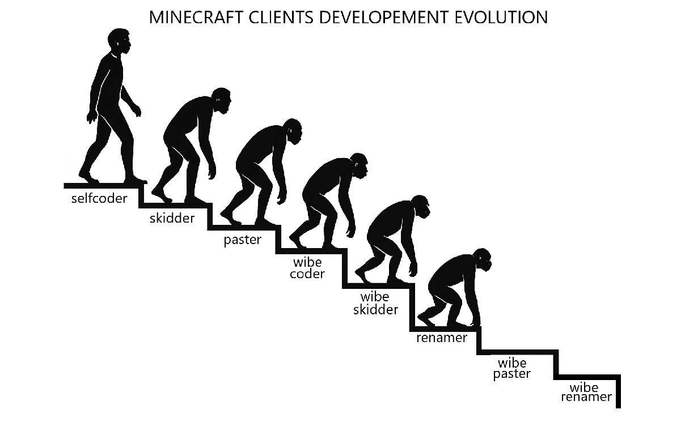

# orionhack
OrionHack Addon for meteor client 1.21.11



# Modules

**TPAttack** Teleports you to blacklisted player and attacks them with mace. It has auto attack which attacks players in 200 blocks (max) range.

**BetterNoFall** Better than meteor nofall, remember to NOT use meteor nofall with this.

**Settings** Some settings.

**HitBack** Attacks blacklisted players when they touch you.

# commands and other info

**commands**

```.blacklist add ItsDumzy```

```.blacklist remove ItsDumzy```

Also there is blacklist tab in meteor menu, just like friends, but you want to mace them.

Turn on settings module and set mace attack height.

# quick guide

```./gradlew clean build --info```

<p>On windows</p>

```gradlew.bat build```

Then drop into mods folder with meteor for 1.21.11

**DO NOT USE Trouser streake macekill with this addon**

# To do:

⬛ HitBack fix

⬛ More modules

⬛ make ts code not scare java compiler


Made by person who has never made meteor addon before and which has skill issue. Woolfist chill its not real OrionHack 😭.
